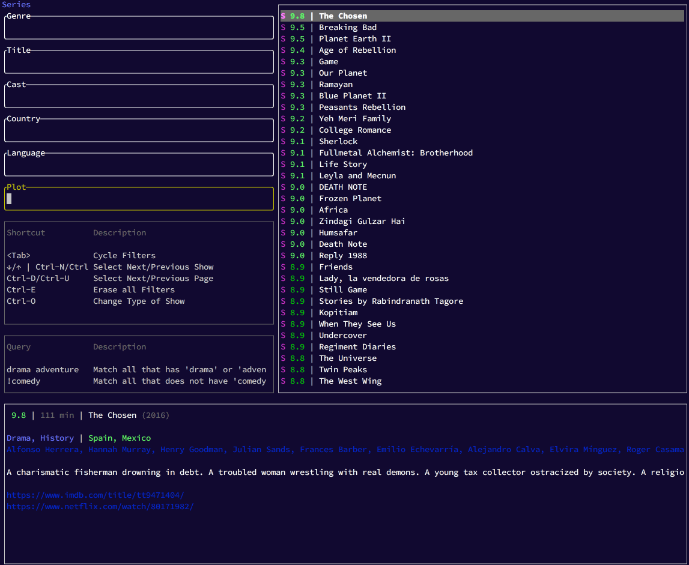

# nf-rated [](https://github.com/thlorenz/nf-rated/actions)

[](./resources/assets/nf-rated.gif)

Query Netflix movies sorted by their IMDB rating.

## Steps to Get Started

Get API key from [omdbapi](http://www.omdbapi.com/).

```sh
OMDB_KEY=<api key> nf-rated sync 

```

Run TUI app to find good shows :)

```sh
nf-rated
```

## LICENSE

MIT
